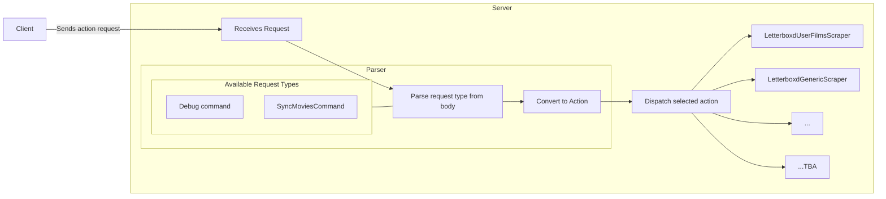

# letterboxd-scraper

To install dependencies:

```bash
bun install
```

To run:

```bash
bun run index.ts
```

This project was created using `bun init` in bun v1.3.1. [Bun](https://bun.com) is a fast all-in-one JavaScript runtime.


